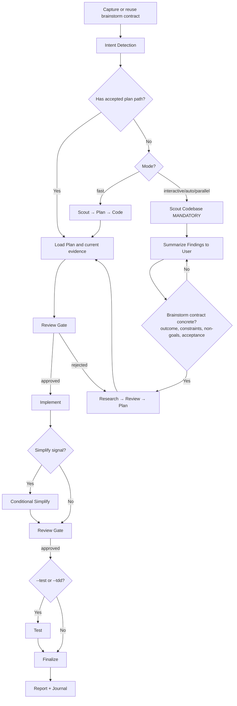

# Execute - Smart Feature Implementation

End-to-end implementation with automatic workflow detection.

**Principles:** KISS, DRY | Full requested scope, nothing extra (`--yagni` to opt into scope-cutting) | Token efficiency | Concise reports

## Usage

```
/athena:exec <natural language task OR plan path>
```

**IMPORTANT:** If no flag is provided, the skill will use the `interactive` mode by default for the workflow.

**Optional flags to select the workflow mode:**

- `--interactive`: Full workflow with user input (**default**)
- `--fast`: Skip research, scout→plan→code
- `--parallel`: Multi-agent execution
- `--skip-code-review`: Skip the code review step
- `--auto`: Auto-approve all steps

**Composable flags** (combine with any mode):

- `--test`: Opt into the testing step (Step 4). Default is to skip it
- `--tasks`: Opt into mirroring progress to the live task-management surface.
  Default is to track progress in plan files only
- `--tdd`: Tests-first per phase — write tests for current behavior before
  refactoring, then verify they still pass after the implementation step.
  Implies `--test`
- `--advice`: Run under `athena` advisory supervision (see Advisory
  supervision)
- `--yagni`: Opt into YAGNI — challenge and cut scope not needed for the stated
  outcome. Default is to implement the full requested scope
- `--journal`: Opt into the automatic `/athena:journal` step at finalize. Default is to
  skip it

Legacy `--no-test` and `--no-tasks` are accepted and ignored (already the default).

**Example:**

```
/athena:exec "Add user authentication to the app" --fast
/athena:exec path/to/plan.md --auto
/athena:exec "Refactor auth middleware" --tdd
```

## Advisory supervision (`--advice`)

When `--advice` is present, run this skill under `athena` supervision.
`athena` is an advisory-only supervisor: it returns counsel, never code, and
the main agent stays responsible for every decision, edit, and gate.

Spawn `athena` at these checkpoints:

- **After each phase completes** — pass the phase goal, what changed, and the
  evidence; ask for a go/no-go and the next risk to watch before the next phase.
- **When stuck** — repeated failures, a blocked step, or contradictory evidence;
  pass everything already tried and the exact obstacle.
- **Before a high-stakes decision** — a design fork, a public-contract or
  security-sensitive change, or an irreversible action; get counsel first.

Invoke with
`delegate_agent capability(subagent_type="athena:athena", prompt="<task, evidence, approaches tried, the exact question>", description="advice: <checkpoint>")`.
Give it enough context to answer in one reply; it does not interview.

**When the workflow reaches a PR** (e.g. handed off to the installed ship
skill): pass `--advice` to the downstream skill so supervision persists across
the handoff. Watch and fix CI until every required check is green, then spawn
`athena` to review the whole implementation and post its assessment plus
concrete next steps as a comment directly on the PR and the source issue (when
one exists).

`--advice` adds supervision; it never bypasses this skill's approval gates,
tests, review blockers, branch protections, or security policy.

<HARD-GATE-BRAINSTORM-FIRST>
Before planning or implementation, capture the opening brainstorm contract:
outcome, constraints, non-goals, and observable acceptance criteria.

- If the input is an accepted plan or design, reuse those fields and identify
  only material gaps.
- If the input is a natural-language task, state the fields from the request and
  ask only about a missing decision that would change the result or safety.
- `--fast`, `--parallel`, and `--auto` change execution shape, not this gate.
- Route concrete bugs to `/athena:fix`; it frames intent first, then proves the root
cause before selecting a solution.
</HARD-GATE-BRAINSTORM-FIRST>

<HARD-GATE>
Do NOT write implementation code until a plan exists and has been reviewed.
This applies regardless of task simplicity. "Simple" tasks are where unexamined assumptions waste the most time.
Exception: `--fast` mode skips research but still requires a plan step.
User override: If user explicitly says "just code it" or "skip planning", respect their instruction.
</HARD-GATE>

<HARD-GATE-SCOUT-FIRST>
After the opening brainstorm gate and before planning, scan the codebase.
Mandatory scout outputs:
1. Project type, language(s), framework(s)
2. Existing modules/files relevant to the task
3. Current patterns/conventions for similar features (so the implementation matches them)
4. Existing docs in `./.athena/docs/` and any in-flight plans in your configured plans dir (`.athena/plans/` by default) covering this area
5. Public APIs, schemas, contracts that the task could affect

State a concise codebase-context summary before asking any further questions.
Skip only when an accepted plan already contains current scout evidence.
</HARD-GATE-SCOUT-FIRST>

<HARD-GATE-EXACT-REQUIREMENTS>
Before producing a plan, the brainstorm contract must be concrete and scout
evidence must identify likely touchpoints and stable public contracts. Ask only
for a material requirement that neither the request, accepted plan, nor current
evidence resolves. Ground questions in discovered paths and behavior.
</HARD-GATE-EXACT-REQUIREMENTS>

<HARD-GATE-NO-SIDE-EFFECTS>
Implementation is NOT done until verified to be side-effect-free. Code-review and test gates MUST prove:

1. New behavior matches every acceptance criterion above.
2. All tests pass — including tests in modules that share files/contracts with the change.
3. No existing business logic / workflow regression: explicitly walk each touchpoint and any caller of changed functions.
4. No new lint/type/build errors anywhere in the repo.
5. Public contracts unchanged unless intentional and called out (function signatures, exported types, API responses, DB schemas, env vars, config keys).

Testing is opt-in: unless `--test` (or `--tdd`) ran the testing step, item 2 is a warning, and the finalize report must print `tests: NOT RUN` and surface the unverified-tests risk in the finalize report — in `--auto` too — so the user sees the trade-off rather than having it silently chosen. Items 1, 3, 4, 5 remain enforceable via the `code-reviewer` subagent unless the user invoked `--skip-code-review`, in which case they are unverified — surface that risk in the finalize `ask_user capability` too.

If review/testing reveals a side effect, regression, or broken workflow, STOP. Use `ask_user capability` to present:

- What broke (file, test, workflow, user-facing behavior)
- Why this implementation caused it (1-line cause)
- 2-4 concrete options for the user to choose, e.g.:
  - "Revert this slice and re-plan with stricter scope"
  - "Keep the implementation and update <dependents> to match the new contract"
  - "Add a compatibility shim at <boundary> so old callers keep working"
  - "Accept the regression — old behavior was unintended/buggy"

Let the user decide. Do not silently patch around regressions.
</HARD-GATE-NO-SIDE-EFFECTS>

## Anti-Rationalization

| Thought                         | Reality                                                                   |
| ------------------------------- | ------------------------------------------------------------------------- |
| "This is too simple to plan"    | Simple tasks have hidden complexity. Plan takes 30 seconds.               |
| "I already know how to do this" | Knowing ≠ planning. Write it down.                                        |
| "Let me just start coding"      | Undisciplined action wastes tokens. Plan first.                           |
| "The user wants speed"          | Fastest path = plan → implement → done. Not: implement → debug → rewrite. |
| "I'll plan as I go"             | That's not planning, that's hoping.                                       |
| "Just this once"                | Every skip is "just this once." No exceptions.                            |

## Smart Intent Detection

| Input Pattern                     | Detected Mode | Behavior                       |
| --------------------------------- | ------------- | ------------------------------ |
| Path to `plan.md` or `phase-*.md` | code          | Execute existing plan          |
| Contains "fast", "quick"          | fast          | Skip research, scout→plan→code |
| Contains "trust me", "auto"       | auto          | Auto-approve all steps         |
| Lists 3+ features OR "parallel"   | parallel      | Multi-agent execution          |
| Default                           | interactive   | Full workflow with user input  |

See `references/intent-detection.md` for detection logic.

If the task needs a cross-skill workflow sequence decision after intent
detection, load `references/workflow-routing.md`.

## Process Flow (Authoritative)



**This diagram is the authoritative workflow.** Prose sections below provide detail for each node. If prose conflicts with this flow, follow the diagram.

## Workflow Overview

```
[Brainstorm Contract] → [Intent Detection] → [Inspect/Research?] → [Review] → [Plan] → [Review] → [Implement] → [Conditional Simplify?] → [Review] → [Test?] → [Review] → [Finalize]
```

**Default (non-auto):** Stops at `[Review]` gates for human approval before each major step.
**Auto mode (`--auto`):** Skips human review gates, implements all phases continuously.
**Progress tracking:** Only with `--tasks`, discover the live task-management
surface at runtime and use it when available. Otherwise, update the active plan directly. Plan files
are the durable source of truth; do not infer support from cached tool lists.

| Mode        | Research | Testing  | Review Gates                     | Phase Progression      |
| ----------- | -------- | -------- | -------------------------------- | ---------------------- |
| interactive | ✓        | `--test` | **User approval at each step**   | One at a time          |
| auto        | ✓        | `--test` | Per `references/review-cycle.md` | All at once (no stops) |
| fast        | ✗        | `--test` | **User approval at each step**   | One at a time          |
| parallel    | Optional | `--test` | **User approval at each step**   | Parallel groups        |
| code        | ✗        | `--test` | **User approval at each step**   | Per plan               |

Testing runs only with `--test` (or `--tdd`), in every mode.

## Step Output Format

```
✓ Step [N]: [Brief status] - [Key metrics]
```

## Blocking Gates (Non-Auto Mode)

Human review required at these checkpoints (skipped with `--auto`):

- **Post-Research:** Review findings before planning
- **Post-Plan:** Approve plan before implementation
- **Post-Implementation:** Approve code before testing (with `--test`) or code review
- **Post-Testing** (only with `--test`): 100% pass + approve before finalize

**Always enforced (all modes):**

- **Testing (only with `--test` or `--tdd`):** 100% pass required. Otherwise print `tests skipped by default (pass --test to run)`
- **Code Review (default; skipped only by `--skip-code-review`):** Spawn `code-reviewer` subagent with explicit checks:
  (a) every acceptance criterion met,
  (b) no regression to business logic in touchpoints/blast-radius,
  (c) no breaking changes to public contracts (signatures, schemas, APIs, env vars) unless called out,
  (d) follows existing patterns from scout,
  (e) no new lint/type/build errors anywhere.
  Pass scout summary + acceptance criteria as context. If reviewer flags side effects → trigger HARD-GATE-NO-SIDE-EFFECTS (`ask_user capability` with 2-4 options).
  Then: user approval or the auto-mode decision in `references/review-cycle.md`.
- **Finalize (MANDATORY - never skip):**
  1. **Activate `/athena:project-management` skill (MANDATORY)** → run full plan sync-back across ALL `phase-XX-*.md` (not only current phase), update `plan.md` status/progress, refresh runtime tracking when `--tasks` is present, generate progress report
  2. Evaluate docs impact; use `docs-manager` only for affected routed authority surfaces
  3. After sync-back verification, reflect completion in the live task-management surface when `--tasks` is present
  4. Ask user if they want to commit via `git-manager` subagent
  5. Run `/athena:journal` to write a concise technical journal entry upon completion — only when the shared "Journal step — opt-in" below applies.

### Journal step — opt-in

Run the automatic `/athena:journal` step only when this applies:

- The invocation includes the `--journal` flag.

Precedence: flag > project config > user config > default (`false`).
When skipped, print one line:

- `journal skipped by default` (no `--journal` flag), or
- `journal skipped by preference` (config).

Explicit `/athena:journal` is unaffected. The rest of the Finalize block above stays MANDATORY.

## Required Subagents (MANDATORY)

| Phase    | Subagent                                                                                     | Requirement                                         |
| -------- | -------------------------------------------------------------------------------------------- | --------------------------------------------------- |
| Research | `researcher`                                                                                 | Optional in fast/code                               |
| Scout    | `scout`                                                                                   | Optional in code                                    |
| Plan     | `planner`                                                                                    | Optional in code                                    |
| Testing  | `tester`, `debugger`                                                                         | **MUST** spawn with `--test`/`--tdd`                |
| Review   | `code-reviewer`                                                                              | **MUST** spawn unless `--skip-code-review`          |
| Finalize | `/athena:project-management`; conditional `docs-manager`; configured git workflow | Project sync and docs-impact decision are mandatory |

**CRITICAL ENFORCEMENT:**

- Steps 4, 5, 6 **MUST** use the live delegation capability to spawn subagents (Step 4 only with `--test`/`--tdd`; Step 5 only when `--skip-code-review` was not passed)
- DO NOT implement testing, review, or finalization yourself - DELEGATE
- If workflow ends without the required delegations, it is INCOMPLETE
- Pattern: `delegate_agent capability(subagent_type="[type]", prompt="[task]", description="[brief]")`
- If the user passed `--yagni`, include it in every subagent prompt and pass it
  to downstream skills, so the opt-in survives the handoff. Without it the
  delegate defaults to delivering the full requested scope.

## References

- `references/intent-detection.md` - Detection rules and routing logic
- `references/workflow-routing.md` - Cross-skill sequence routing for ambiguous workflows
- `references/workflow-steps.md` - Detailed step definitions for all modes
- `references/review-cycle.md` - Interactive and auto review processes
- `references/subagent-patterns.md` - Subagent invocation patterns
- `references/plan-state-files-first.md` - Canonical plan-file model

## Workflow Position

**Typically follows:** `/athena:plan` (execute a plan), `/athena:brainstorm` (implement agreed solution)
**Typically precedes:** `/athena:code-review` (review after implementation), `the installed test skill` (validate changes)
**Related:** `/athena:fix` (alternative for bug fixes), `/athena:plan` (create plan before execution)
