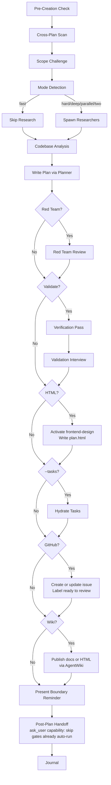

# Planning

Create detailed technical implementation plans through research, codebase analysis, solution design, and comprehensive documentation.

## Integration

This skill orchestrates planning, but owns plan file scaffolding and phase state mutations.

**Files-first:** `plan.md` + `phase-NN-*.md` under `<timestamp>-<slug>/` in your
configured plans dir (`.athena/plans/` by default).
A GitHub issue is an optional visibility projection the agent publishes with
`gh` / the GitHub API, never required and never canonical — a repo with no
GitHub remote still has a fully working plan as files. Full model: `../exec/references/plan-state-files-first.md`.

Rules:

- When `--html` is present, the final user-facing plan artifact is `plan.html`.
  Use the live scaffolding operation only when a plan directory, active-plan metadata, or a
  `--github` companion `plan.md` index is needed. Do not duplicate the full plan
  body across Markdown and HTML.
- Default scope is project-local (your configured plans dir, `.athena/plans/` by default, under the current project).
- Global scope is conditional: use the configured global plans root only when the user asks for global planning or no project context exists.
- Do not hand-edit the phases table for status toggles or structural updates when CLI commands are available.
- **Generated-file write guard:** plan scaffolding operations create existing `plan.md` and `phase-XX-*.md` stub files. Before composing long replacement content, run a read pass over `plan.md` and **every generated phase stub**. A directory listing is not enough. Some runtimes enforce read-before-write on existing files; skipping a stub read can reject the later write. The stubs are tiny, so read them all first, then fill them.

### Mandatory Generated-File Read Pass

After scaffolding and before the first long write or edit to any generated plan file:

1. Enumerate generated files: `plan.md` plus all `phase-*.md`.
2. Read `plan.md`.
3. Read every generated `phase-*.md` stub, including future phases you have not drafted yet.
4. Only after the read pass, write or edit the full content for `plan.md` and each phase.

Do not draft or submit a full phase body for a generated stub that has not been read in the current session.

### Canonical Phase File Template

Use this structure when filling each `phase-XX-*.md`. Loaded once with the skill — no per-file Read needed to learn it. Frontmatter fields match the CLI's phase schema; section headers match `documentation-management.md` so phase files stay consistent across plans.

```markdown
---
phase: <N>
title: '<Phase Name>'
status: pending # pending | in-progress | completed
priority: P2 # P1 | P2 | P3
effort: '' # e.g. "4h", "2d"
dependencies: [] # phase IDs this blocks on
---

# Phase <id>: <Name>

## Overview

<1-2 sentences describing what this phase delivers>

## Requirements

- Functional: ...
- Non-functional: ...

## Architecture

<Design, data flow, component interactions>

## Related Code Files

- Create: `path/...`
- Modify: `path/...`
- Delete: `path/...`

## Implementation Steps

1. ...
2. ...

## Success Criteria

- [ ] ...

## Risk Assessment

<Risks + mitigations. For a risk resting on an assumption that may break: the
observable signal it broke, and the pre-decided response — adjust, or replan.>
```

**IMPORTANT:** Before you start, scan unfinished plans in the active scope first:

- Project scope: your configured plans dir (`.athena/plans/` by default)
- Global scope: the configured global plans root
  - Default when unset: `~/.claude/plans/`

If there are relevant plans overlapping your upcoming plan, update them as well. If you're unsure or need more clarifications, use `ask_user capability` tool to ask the user.

### Scope Selection

- **Project scope** is the default whenever the current working tree has project context.
- **Global scope** is allowed only when:
  - the user explicitly asks for it via `--global`, or
  - there is no project context to anchor a local plan.
- **No project context** means no `.git`, `package.json`, or `CLAUDE.md` was found in the ancestor chain.
- Keep scope honest in prose and examples: the skill describes CLI-owned behavior, it does not implement scope resolution itself.

### Cross-Plan Dependency Detection

During the pre-creation scan, detect and mark blocking relationships between plans:

1. **Scan** — Read `plan.md` frontmatter of each unfinished plan (status != `completed`/`cancelled`)
2. **Compare scope** — Check overlapping files, shared dependencies, same feature area
3. **Classify relationship:**
   - New plan needs output of existing plan → new plan `blockedBy: [existing-plan-dir]`
   - New plan changes something existing plan depends on → existing plan `blockedBy: [new-plan-dir]`, new plan `blocks: [existing-plan-dir]`
   - Cross-scope dependency → use `global:` or `project:` prefixes
   - Mutual dependency → both plans reference each other in `blockedBy`/`blocks`
4. **Bidirectional update** — When relationship detected, update BOTH `plan.md` files' frontmatter
5. **Ambiguous?** → Use `ask_user capability` with header "Plan Dependency", present detected overlap, ask user to confirm relationship type (blocks/blockedBy/none)

**Frontmatter fields**:

```yaml
blockedBy: [<timestamp>-auth-system] # Same-scope dependency
blockedBy: [global:<timestamp>-auth-system] # Cross-scope dependency
blocks: [project:<timestamp>-user-dashboard] # Explicit project-scope dependency
```

## Default (No Arguments)

If invoked with a task description, proceed with planning workflow. If invoked WITHOUT arguments or with unclear intent, use `ask_user capability` to present available operations:

| Operation   | Description                           |
| ----------- | ------------------------------------- |
| `(default)` | Create implementation plan for a task |
| `archive`   | Write journal entry & archive plans   |
| `red-team`  | Adversarial plan review               |
| `validate`  | Critical questions interview          |

Present as options via `ask_user capability` with header "Planning Operation", question "What would you like to do?".

## Workflow Modes

Default: auto-detect planning mode (analyze task complexity and pick mode).

| Flag         | Mode           | Research                          | Red Team        | Validation      | Exec Flag    |
| ------------ | -------------- | --------------------------------- | --------------- | --------------- | ------------ |
| `--auto`     | Auto-detect    | Follows mode                      | Follows mode    | Follows mode    | Follows mode |
| `--fast`     | Fast           | Skip                              | Skip            | Skip            | (none)       |
| `--hard`     | Hard           | 2 researchers                     | Yes             | Optional        | (none)       |
| `--deep`     | Deep           | 2-3 researchers + per-phase scout | Yes             | Yes             | (none)       |
| `--parallel` | Parallel       | 2 researchers                     | Yes             | Optional        | `--parallel` |
| `--two`      | Two approaches | 2+ researchers                    | After selection | After selection | (none)       |

**Composable flags** (combine with any mode):

| Flag         | Effect                                                                                                                                                                                                          |
| ------------ | --------------------------------------------------------------------------------------------------------------------------------------------------------------------------------------------------------------- |
| `--tdd`      | Add tests-first structure to each phase for regression-safe refactors                                                                                                                                           |
| `--tasks`    | Opt into task hydration: mirror phases to the live task-management surface. Default: skip; plan files only                                                                                                      |
| `--test`     | Forward to `/athena:exec` on handoff to opt into its testing step. Default: exec skips testing                                                                                                                  |
| `--html`     | Output a self-contained editorial interactive HTML plan with visible phase outlines, markdown detail modals, and optional generated watercolor technical sketch imagery                                         |
| `--github`   | Create or update a GitHub issue after plan validation with branch, summary, plan links, open questions, and `ready to review`                                                                                   |
| `--wiki`     | Publish the final reviewed plan docs or HTML artifact via CLI or MCP when available                                                                                                                |
| `--advice`   | Run under `athena` advisory supervision (see Advisory Supervision Mode)                                                                                                                                       |
| `--yagni`    | Opt into YAGNI: challenge and cut scope not needed for the stated outcome (default: plan the full requested scope). Forward it to every subagent prompt and downstream skill, or the opt-in dies at the handoff |
| `--journal`  | Opt into the automatic `/athena:journal` step at the end of the workflow. Default is to skip it                                                                                                                        |

### Advisory Supervision Mode (`--advice`)

When `--advice` is present, run this skill under `athena` supervision.
`athena` is an advisory-only supervisor: it returns counsel, never code, and
the main agent stays responsible for every decision, edit, and gate.

Spawn `athena` at these checkpoints:

- **After each planning phase, gate, or major analysis completes** (research,
  solution design, red-team, validation) — pass the goal, what was concluded,
  and the evidence; ask for a go/no-go and the next risk to watch.
- **When stuck** — repeated failures, a blocked step, or contradictory evidence;
  pass everything already tried and the exact obstacle.
- **Before a high-stakes decision** — a design fork, a public-contract or
  security-sensitive change, or an irreversible action; get counsel first.

Invoke with
`delegate_agent capability(subagent_type="athena:athena", prompt="<task, evidence, approaches tried, the exact question>", description="advice: <checkpoint>")`.
Give it enough context to answer in one reply; it does not interview.

**When the workflow reaches a PR** (here, via `--github` or a downstream
`/athena:exec`/`/athena:ship` handoff): pass `--advice` to the downstream skill so
supervision persists across the handoff. Watch and fix CI until every required
check is green, then spawn `athena` to review the whole implementation and
post its assessment plus concrete next steps as a comment directly on the PR
and the source issue (when one exists).

`--advice` adds supervision; it never bypasses this skill's approval gates,
red-team/validation gates, or security policy.

### HTML Output Mode (`--html`)

When `--html` is present, activate `/athena:frontend-design` before composing the
HTML artifact. If `frontend-design` requires design intelligence, follow its activation rule before styling.

**Artifact rules:**

- Write the primary output as `plan.html` in the selected plan directory.
- The HTML file must be self-contained: inline CSS and JavaScript, no build
  step, no network-required assets.
- If generated image assets are used, embed selected images as data URIs so
  `plan.html` remains portable; keep source images under `{plan-dir}/assets/`
  for review only.
- Generate `plan.html` after red-team and validation gates so the HTML reflects
  the final reviewed plan. Markdown files produced for CLI scaffolding or gate
  compatibility are not the user-facing deliverable in this mode.
- If another workflow requires `plan.md` (for example `--github`), keep
  `plan.md` as a concise index that points to `plan.html`; do not duplicate the
  full plan body unless a downstream `/athena:exec` handoff explicitly needs it.
- Include accessible responsive UI, keyboard-friendly controls, and reduced
  motion handling.

**Content requirements:**

- Plan overview and phase roadmap.
- Main page must show a concise outline summary for every phase: title, status,
  priority, dependencies, objective, 3-6 key bullets, related files,
  success criteria highlights, and test/validation gate when known.
- Each phase outline must open a detail modal rendering the full phase markdown:
  headings, lists, checkboxes, tables, fenced code, inline code, blockquotes,
  links, horizontal rules, and frontmatter metadata. Escape raw HTML unless a
  trusted sanitizer is bundled inline.
- User flows.
- **Implementation workflow diagram (required):** at least one visual diagram
  (flowchart, sequence, or architecture) rendered inline in HTML/CSS/SVG/Canvas
  that shows what will be built and the phase/dependency flow. Under `--html`
  this is mandatory, not optional.
- **UI/UX mockups with annotations (required when the plan touches UI/UX):**
  embed annotated visual mockups of the proposed screens or components directly
  in `plan.html` so the user previews the intended interface before
  implementation. Derive layout, color, type, spacing, and component states from
  the project design guidelines (`.athena/docs/design-guidelines.md` when present,
  otherwise the built-in editorial contract below). Annotate each mockup with
  callouts tying elements to design tokens, interaction states, and the
  acceptance criteria they satisfy.
- Other diagrams and charts rendered directly in HTML/CSS/SVG/Canvas when useful.
- Interactive affordances such as tabs, filters, expandable risks, or chart
  toggles when useful.
- Citations as visible URLs for external sources, GitHub issues, docs, and
  any web references used.
- Open questions section; write "None" when there are no unresolved questions.

**Design direction:**

- Use the editorial magazine style contract from the user's supplied guideline
  when present; otherwise use this built-in contract.
- Use warm paper `#faf7f2`, paper panels `#f0ebe1`, ink `#0a0a0a`, muted
  `#6b6258`, accent red `#b8232c`, hairline dividers, serif display, mono
  labels, and restrained sans body.
- Use print-editorial structure: cover section, running mono slide tags/folios,
  generous whitespace, asymmetric grids, rule lines, pull quotes, stat bands,
  and fixed nav dots when useful.
- Avoid gradients, drop shadows, rounded cards, pure white backgrounds, generic
  SaaS styling, decorative bokeh/orbs, emoji icons, and hidden instructions.
- Use accent only for italic serif emphasis, eyebrows, active states, left
  rules, and small data highlights. Include subtle CSS paper grain.
- Keep typography readable on mobile and desktop; no horizontal scrolling.

### GitHub Issue Projection (`--github`, optional publish)

When `--github` is present, publish an OPTIONAL visibility projection of the
validated plan to a GitHub issue after validation and red-team gates finish and
before implementation handoff. `plan.md` + phase files remain canonical either
way — this step never replaces them and is skipped entirely in a repo with no
GitHub remote or `gh` auth (report the skip, do not fail the plan).

**How to publish — the agent uses `gh` / the GitHub API directly.** 
When `gh` is installed and authenticated (or a GitHub token is available for the
API), create or update the issue with the `gh` sequence below. Gate it on repo
visibility and a secret scan before writing anything to GitHub.

**When GitHub is not reachable** (`gh` not installed, not authenticated, or no
token). Report the skip to the user, name what is missing, and suggest the
concrete next step (e.g. `gh auth login`, or exporting a token) so they can enable
publishing if they want it. The plan is fully usable as files either way.

**Required issue fields:**

- Branch name from `git branch --show-current`.
- Plan summary.
- Repo-relative link to `plan.md`.
- Repo-relative link to `plan.html` when `--html` is present.
- Repo-relative link to the brainstorm report when one exists; otherwise state
  `Brainstorm report: None found`.
- Open questions when present; otherwise state `Open questions: None`.
- Acceptance criteria from the validated plan.

**Required label:** `ready to review`.

Lifecycle labels (`ready to exec`, `in progress`, `ready to ship *`); `ready to review` marks a
plan-awaiting-human-review stage before `ready to exec`.

**`gh` sequence:**

```bash
gh label list --json name --jq '.[].name' | grep -Fx "ready to review" >/dev/null \
  || gh label create "ready to review" --color "C5DEF5" --description "Plan ready for human review"
gh issue create --title "<plan title>" --body-file "<body.md>" --label "ready to review"
```

- If an issue already exists for the same plan or branch, update/comment on it
  instead of creating a duplicate.
- All links posted to GitHub must be repo-relative. Do not post absolute local
  filesystem paths.
- Redact secrets, env values, tokens, customer data, private logs, and local
  machine-specific details before writing issue bodies or comments.
- If `gh` cannot create labels or issues, stop and report the exact error to the
  user; do not treat it as a plan-creation failure.

### Combined `--html --github`

`plan.html` is the authoritative plan. Create a short companion `plan.md` index
only to satisfy the GitHub issue's stable `plan.md` link requirement. The issue
must include both relative links.

**Security rules:**

- Redact secrets, env values, tokens, customer data, private logs, and
  local-machine-only paths before publishing.
- Prefer repo-relative paths and public-safe summaries.
- Publish only final reviewed artifacts; do not publish intermediate research
  notes unless the user explicitly asks.

Load: `references/workflow-modes.md` for auto-detection logic, per-mode workflows, context reminders.

## When to Use

- Planning new feature implementations
- Architecting system designs
- Evaluating technical approaches
- Creating implementation roadmaps
- Breaking down complex requirements

## Core Responsibilities & Rules

Always honoring **KISS** and **DRY** principles. Deliver the full requested scope — never trim or defer what the user explicitly asked for. Add nothing unrequested. With `--yagni`, additionally challenge and cut any scope not needed for the stated outcome.
**Be honest, be brutal, straight to the point, and be concise.**

### 0. Scope Challenge

Load: `references/scope-challenge.md`
**Skip if:** trivial task (single file fix, <20 word description). `--fast`
changes planning depth only; it never skips the requested-scope baseline or
authorizes scope reduction. Present the reduction fork only with `--yagni`.

### 1. Research & Analysis

Load: `references/research-phase.md`
**Skip if:** Fast mode or provided with researcher reports

### 2. Codebase Understanding

Load: `references/codebase-understanding.md`
**Skip if:** Provided with scout reports

### 3. Solution Design

Load: `references/solution-design.md`

### 4. Plan Creation & Organization

Load: `references/plan-organization.md`

### 5. Task Breakdown & Output Standards

Load: `references/output-standards.md`

## Process Flow (Authoritative)



**This diagram is the authoritative workflow.** Prose sections below provide detail for each node.

## Workflow Process

1. **Pre-Creation Check** → Check Plan Context for active/suggested/none
   1b. **Cross-Plan Scan** → Scan unfinished plans, detect `blockedBy`/`blocks` relationships, update both plans
   1c. **Scope Challenge** → Run Step 0 scope questions, select mode (see `references/scope-challenge.md`)
   **Skip if:** trivial task. `--fast` changes planning depth only; present the
   reduction fork only with `--yagni`
2. **Mode Detection** → Auto-detect or use explicit flag (see `workflow-modes.md`)
3. **Research Phase** → Spawn researchers (skip in fast mode)
4. **Codebase Analysis** → Read docs, scout if needed
5. **Plan Documentation** → Write comprehensive plan via planner subagent
6. **Red Team Review** → Run `/athena:plan red-team {plan-path}` (hard/deep/parallel/two modes)
7. **Post-Plan Validation** → Run `/athena:plan validate {plan-path}` (hard/deep/parallel/two modes)
8. **HTML Artifact** → If `--html`, activate `/athena:frontend-design` and write final reviewed `plan.html` as the primary output
9. **Hydrate Progress** → Only with `--tasks`: mirror phases into live task management when available. Otherwise print `task tracking skipped by default (pass --tasks to enable)`
10. **GitHub Issue** → If `--github`, create/update issue and apply `ready to review`
11. **AgentWiki Publish** → If `--wiki`, publish final docs privately or upload `plan.html` only when AgentWiki CLI/MCP is available and the requested visibility permits it
12. **Boundary Reminder** → Present optional next-step commands with absolute path
13. **Journal** → Run `/athena:journal` to write a concise technical journal entry upon completion — only when the shared "Journal step — opt-in" block below applies.

### Journal step — opt-in

Run the automatic `/athena:journal` step only when this applies:

- The invocation includes the `--journal` flag.

Precedence: flag > project config > user config > default (`false`).
When skipped, print one line:

- `journal skipped by default` (no `--journal` flag), or
- `journal skipped by preference` (config).


### Whole-Plan Consistency Gate

This gate is mandatory after `/athena:plan validate` or `/athena:plan red-team` edits any plan file.
Load: `references/verification-roles.md` → "Whole-Plan Consistency Sweep".

Before recommending `/athena:exec`, re-read `plan.md` and every `phase-*.md` file. Search all plan files for stale terms, rejected assumptions, renamed APIs/files/fields, superseded decisions, and duplicate embedded drafts/contracts. Reconcile contradictions across the entire plan, not only the edited phase.

If unresolved contradictions remain, report them and ask the user. Do not recommend exec until the whole-plan consistency sweep reports zero unresolved contradictions.

## Output Requirements

**IMPORTANT:** Invoke "/project-organization" skill to organize the outputs.

- DO NOT implement code - only create plans
- Respond with plan file path and summary
- Ensure self-contained plans with necessary context
- Include code snippets/pseudocode when clarifying
- With `--html`, respond with the `plan.html` path, the companion `plan.md`
  index path when one exists, and a short note that HTML is authoritative.
- With `--github`, respond with the GitHub issue URL and confirm the
  `ready to review` label was applied.
- With `--wiki`, respond with the AgentWiki document/share/site URL when
  published, or state the exact reason publishing was skipped.
- Discover and follow the consuming repository's instruction and development-standard documents; do not assume a fixed docs path

## Task Management

Plan files are the durable source of truth. Runtime task views may be session-scoped; hydration mirrors the plan without replacing it.

**Default:** Skip runtime tracking; plan files only. With `--tasks`, discover the live task-management surface after writing plan files and mirror phases there when available. Legacy `--no-tasks` is accepted and ignored.
**3-Item Rule:** With `--tasks`, fewer than 3 phases → still skip runtime tracking.
**Fallback:** If no live surface exists, update the active plan directly. Planning and handoff remain fully functional.

Load: `references/task-management.md` for the hydration and exec handoff protocol.

### Hydration Workflow

1. Write plan.md + phase files (persistent layer)
2. Discover the live task-management surface
3. If available, mirror phases, dependencies, and critical/high-risk steps there
4. Retain enough context to map every runtime item back to its plan phase and checklist item
5. Exec reuses the live view when present or rebuilds it from unchecked plan items

## Active Plan State

Check `## Plan Context` injected by hooks:

- **"Plan: {path}"** → Active plan. Ask "Continue? [Y/n]"
- **"Suggested: {path}"** → Branch hint only. Ask if activate or create new.
- **"Plan: none"** → Create new using `Plan dir:` from `## Naming`

After creating plan, activate the created plan as active plan.
Reports: Active plans → plan-specific path. Suggested → default path.

### Important

**DO NOT** create plans or reports in arbitrary user directories.
**MUST** create plans or reports in one of these allowed roots:

- project scope → current working project directory
- global scope → configured global plans root
  - Default when unset: `~/.claude/plans/`

## Subcommands

| Subcommand          | Reference                         | Purpose                                         |
| ------------------- | --------------------------------- | ----------------------------------------------- |
| `/athena:plan archive`  | `references/archive-workflow.md`  | Archive plans + write journal entries           |
| `/athena:plan red-team` | `references/red-team-workflow.md` | Adversarial plan review with hostile reviewers  |
| `/athena:plan validate` | `references/validate-workflow.md` | Validate plan with critical questions interview |

## Post-Plan Handoff (MANDATORY at session end)

After `plan.md` + phase files are written and the user has reviewed/approved them, use `ask_user capability` to offer the appropriate next step. Recommend the option that best fits the plan's risk/scope; recommended option listed FIRST and labelled "(Recommended)".

| Option                 | Recommend When                                                                                      | Why                                                                                                  |
| ---------------------- | --------------------------------------------------------------------------------------------------- | ---------------------------------------------------------------------------------------------------- |
| `/athena:plan validate`    | Plan is moderate-to-complex; user wants critical-questions interview before implementation          | Cheapest gate — surfaces unspecified assumptions, missing acceptance criteria, hand-wavy phases      |
| `/athena:plan red-team`    | Plan touches security, auth, payments, data integrity, public APIs, infra, or has high blast radius | Adversarial reviewers stress-test the plan for failure modes, attack vectors, and missing edge cases |
| `/athena:exec <plan-path>` | Plan is small / well-understood / low-risk and user wants to start implementation                   | Skip extra gates; go straight to implementation                                                      |
| End session            | User wants to review/share plan before deciding                                                     | Stop with plan path returned                                                                         |

**Skip this step ONLY when:**

- The current invocation IS already a subcommand (`validate`, `red-team`, `archive`) — those have their own terminal handoff.
- User explicitly said "just plan, don't suggest next step".

**Skip an individual option ONLY when the active mode already auto-ran that gate (per Workflow Process Steps 6-7):**

- Omit `/athena:plan red-team` from the offered options when mode is `--hard`, `--deep`, `--parallel`, or `--two` (Step 6 already ran adversarial review).
- Omit `/athena:plan validate` from the offered options when mode is `--deep` (Step 7 already ran validation).
- If both gates already ran, the Post-Plan Handoff still fires but offers only `/athena:exec <plan-path>` and `End session`.

After selection: invoke the chosen command with the plan path as argument for continuity. Forward `--tasks` / `--test` (and `--advice` / `--yagni`) to `/athena:exec` when the user passed them.

## Quality Standards

- Thorough and specific, consider long-term maintainability
- Research thoroughly when uncertain
- Address security and performance concerns
- Detailed enough for junior developers
- Validate against existing codebase patterns

**Remember:** Plan quality determines implementation success. Be comprehensive and consider all solution aspects.

## Workflow Position

**Typically follows:** `/athena:brainstorm` (after exploring options), `/athena:scout` (after codebase discovery)
**May precede:** `/athena:exec` after user approval (otherwise stop with plan path and next-step options)
**Related:** `/athena:brainstorm` (explore before planning), `/athena:exec` (execute after planning)
